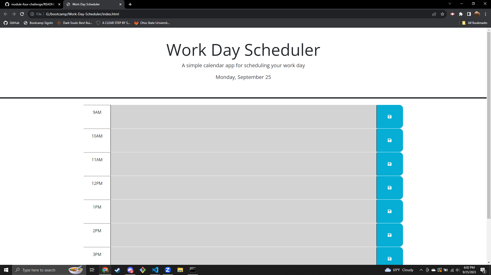

# Work-Day-Scheduler

## Description

A work day scheduler application. Users can enter information into the textboxes and save the data to their local storage. The color of the text boxes change based on the hour of the day.

## Screenshot

## Deployment link:

https://silverfoot42.github.io/work-day-scheduler/

## Credits

The following sections of code were provided with the assistance of fellow bootcamp classmate Grant Wolff:

saveBTN.on('click', function () {
      timeBlockId = $(this).closest(".time-block").attr("id");
      var userInput = $(this).siblings(".description").val();
      localStorage.setItem(timeBlockId, userInput);
    });

    $(".time-block").each(function() {
      var timeID = $(this).attr("id");
      var savedIn = localStorage.getItem(timeID);

      if(savedIn) {
        $(this).find(".description").val(savedIn);
      }
    });